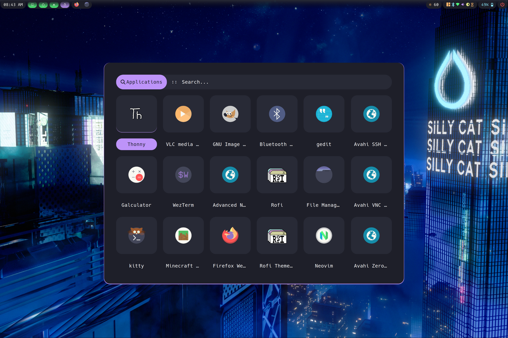
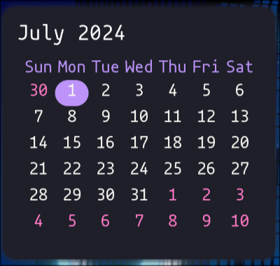
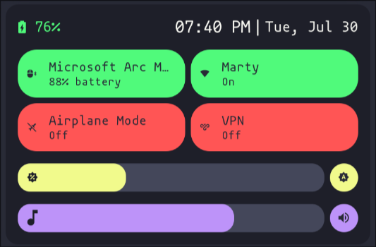
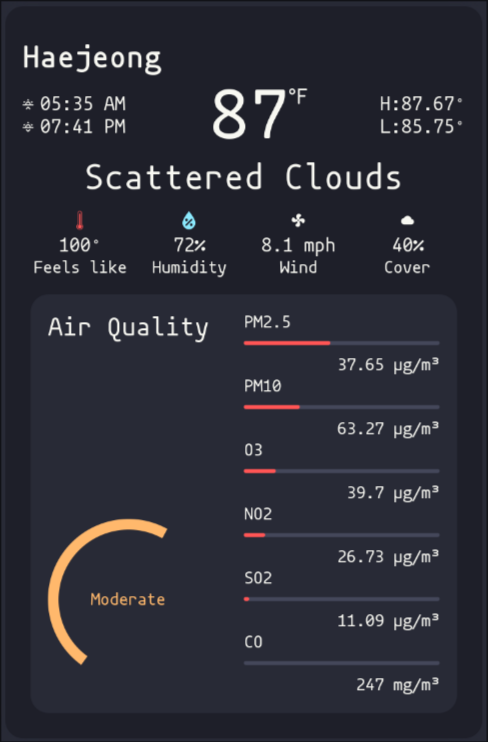

# Marty's Dotfiles

 

**Warning:** Works on my machine doens't mean it'll work on yours. Use at your own risk.
Lots of older configs in another repo [here](https://github.com/Marty1820/old-dotfiles)

## Details

- **Shell**: ZSH
- **WM**: [Hyprland](https://hyprland.org/)
- **Status Bar**: [EWW](https://elkowar.github.io/eww/eww.html)
- **Application Launcher**: [rofi wayland fork](https://github.com/lbonn/rofi)
- **Terminal**: Kitty

#### Keybound Apps

|       Name       |           Description            |
| :--------------: | :------------------------------: |
|      `nvim`      |           `Super + a`            |
|     `gedit`      |       `Super + shift + a`        |
|    `pcmanfm`     |           `Super + e`            |
|    `firefox`     |           `Super + b`            |
|    `chromium`    |       `Super + shift + b`        |
|      `rofi`      |    `Super + d` = applications    |
| `grim` & `slurp` | Print Screen key for screenshots |

#### Bash & ZSH alias's

|        Name         |                 Description                  |
| :-----------------: | :------------------------------------------: |
|        `exa`        |               `ls` replacement               |
|        `bat`        |          Replacing `cat` with `bat`          |
|      `mirror`       |    Updates mirrors with reflector on Arch    |
|     `starship`      |         Changes the terminal prompt          |
| Decompression Tools | `ex filename` extracts most compressed files |

# Hyprland Screenshot

Desktop & status bar

Application launcher [rofi](https:/github.com/lbonn/rofi)

Calendar

Control center

Weather widget

